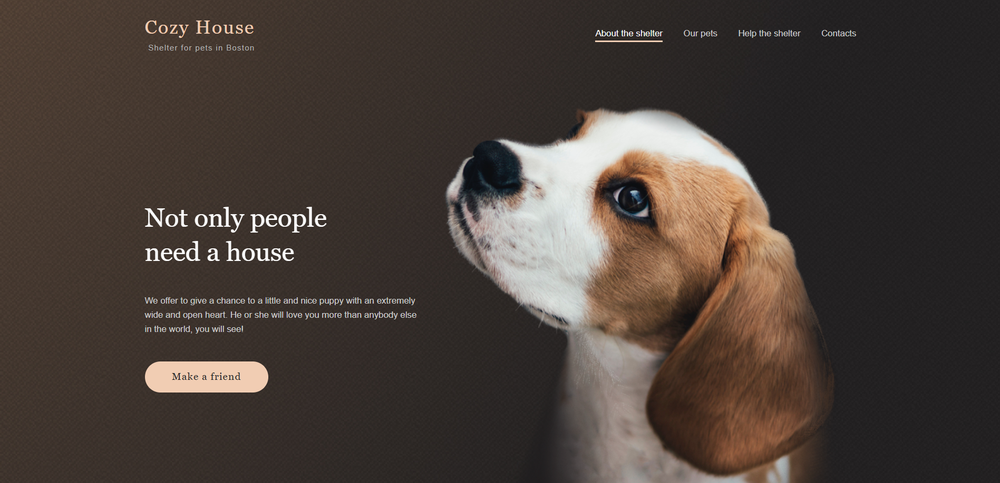
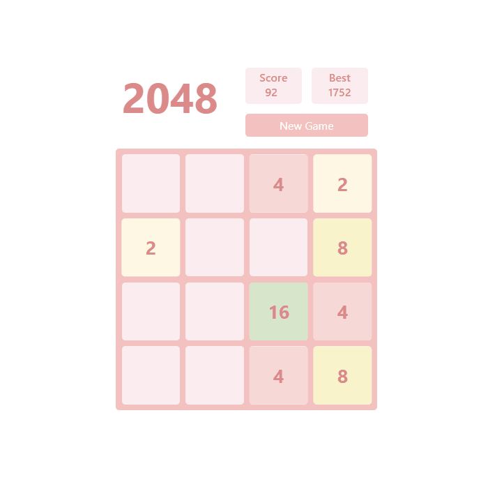
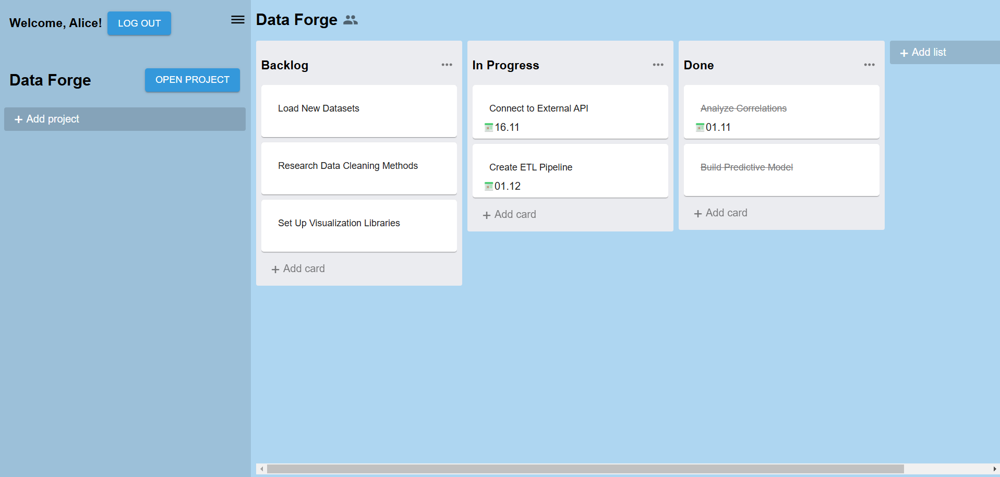

# Diana Butiakova
### Front-end Developer

## Contacts
Location: Bishkek, Kyrgyzstan\
E-mail: butyakova01@gmail.com\
[Telegram](https://t.me/bt_diana)\
[LinkedIn](https://www.linkedin.com/in/butiakova-diana)\
[Github](https://github.com/bt-diana)


## Summary
My career began with business and system analysis. During that time, I handled tasks such as studying the client's business problems, forming functional requirements, wireframing user interfaces, writing specifications for development, and describing initial test cases.

Currently, I am retraining as a front-end developer. I have a solid knowledge of the pure HTML + CSS + JavaScript/TypeScript stack and also React (JSX/TSX) + Redux + React Router stack. I have experience implementing designs from Figma mockups, providing responsive and adaptive layouts for tablets and mobile devices.

My experience in interacting with customers and analyzing functional requirements, combined with my experience in building fully-featured websites for all kinds of devices, will help me provide the best solutions.

## Skills 
- HTML, CSS, JavaScript, TypeScript
- WebPack, Vite
- HTTP, Websockets
- React, Redux, Axios, React Routes
- Git
- Docker
- Figma

## Code Example
```
'use strict';
const Vector = class{
  
  constructor(arr) {
    this.vector = arr;  
  };
  
  toString() {
    return '(' + this.vector.join(',') + ')';
  };
  
  add(val) {
    if (this.vector.length !== val.vector.length)
       throw new Error();
    return new Vector(this.vector.map((x, i) => x + val.vector[i]));
  };
  
  subtract(val) {
    if (this.vector.length !== val.vector.length)
       throw new Error();
    return new Vector(this.vector.map((x, i) => x - val.vector[i]));
  };
  
  dot(val) {
    if (this.vector.length !== val.vector.length)
       throw new Error();
    return this.vector.reduce((preV, curV, i) => preV + curV * val.vector[i], 0);
  };
  
  norm() {
    return Math.sqrt(this.vector.reduce((preV, curV, i) => preV + Math.pow(curV, 2), 0));
  };
  
  equals(val) {
    return this.vector.toString() === val.vector.toString();
  };
}
```

## Experience
### Website "Shelter"
Website created using JS, HTML, CSS, and WebPack. The design was implemented from a Figma mockup. It features responsive adaptive layout for tablets and mobile devices.

#### Stack:
- HTML, CSS, JavaScript
- WebPack
- Figma

#### [Build](https://rolling-scopes-school.github.io/djhsgfjk-JSFEPRESCHOOL2024Q2/shelter/main)



### 2048 game
2048 browser game on pure JS, HTML, and CSS using Webpack and MVC architecture.

#### Stack:
- HTML, CSS, JavaScript
- WebPack

#### [Build](djhsgfjk.github.io/2048)
#### [Source code](github.com/djhsgfjk/2048/tree/main)



### Fullstack task management application
Full-stack task management application that represents a kanban-board with drag-and-drop lists and cards. The front-end uses React with Redux, Axios, MUI and Docker for deployment.

#### Frontend Stack:
- React, Redux, Axios
- MUI, react-beautiful-dnd
- Docker - for deployment

#### Backend Stack:
- Python, Django
- Docker - for deployment

#### [Build](http://209.126.0.235:3000)
#### [Source code](github.com/djhsgfjk/task-manager-app)



## Education
### Bachelor's degree, 2023
__Kazan (Volga region) Federal University__\
Institute of Computational Mathematics and Information Technology,
Fundamental Informatics and Information Technology

## Certifications
### [JS/FE PRE-SCHOOL 2024Q2 (JAVASCRIPT)](https://app.rs.school/certificate/9cr8x76q)
The Rolling Scopes School


## Languages
- English - Upper-intermediate
- Russian - Native
